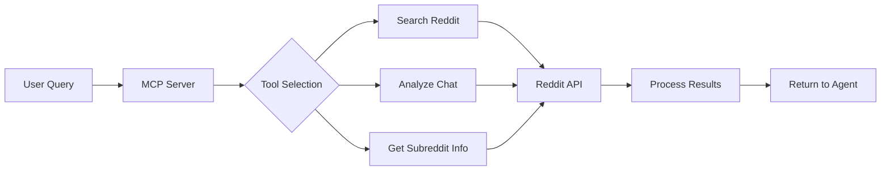

# Reddit MCP Server 🤖

A Model Context Protocol (MCP) server that enables AI agents to search and analyze Reddit content intelligently. Built with Python and PRAW.


## ✨ Features

- 🔍 **Smart Reddit Search** - Search across all subreddits or specific communities
- 💬 **Context-Aware Crawling** - Extract insights from chat conversations to find relevant discussions  
- 📊 **Subreddit Analytics** - Get detailed information about any subreddit
- 🛡️ **Privacy-First** - Automatic anonymization of personal information
- ⚡ **Real-time Results** - Direct integration with Reddit's API

## 🚀 Quick Start

### Prerequisites

- Python 3.13
- Reddit API credentials ([Get them here](https://www.reddit.com/prefs/apps))
- MCP-compatible client (Claude Desktop, Cline, MCP instructor etc.)

### Installation

1. **Clone the repository**
```bash
git clone https://github.com/khyati1122/ChatBuddy.git
cd mcp-server
```

2. **Set up Python environment**

#### Option A: Using uv (Recommended - Faster)
```bash
# Install uv if you haven't already
curl -LsSf https://astral.sh/uv/install.sh | sh  # macOS/Linux
# or

# Windows (PowerShell)
powershell -ExecutionPolicy ByPass -c "irm https://astral.sh/uv/install.ps1 | iex"

# Or via pip
pip install uv  # Any platform

# Create Environment
# This creates .venv and installs everything from uv.lock and pyproject.toml
uv sync

# Activate the environment
source .venv/bin/activate  # On Windows: .venv\Scripts\activate

# Alternative method to setup env
uv venv
source .venv/bin/activate  # On Windows: .venv\Scripts\activate
uv add -r requirements.txt
```

#### Option B: Using traditional pip
```bash
python -m venv venv
source venv/bin/activate  # On Windows: venv\Scripts\activate
pip install -r requirements.txt
```

4. **Configure Reddit API**

Create a Reddit app at https://www.reddit.com/prefs/apps:
- Click "Create App" 
- Choose "script" as the app type
- Note your Client ID and Client Secret

Create a `.env` file in the project root (see .env.example):
```env
REDDIT_CLIENT_ID=your_client_id_here
REDDIT_CLIENT_SECRET=your_secret_here
REDDIT_USER_AGENT=MCP Reddit Crawler v1.0
```

## 🔧 Available Tools

### `search_reddit_keywords`
Search Reddit with specific keywords and filters.

**Parameters:**
- `keywords` (list): Search terms
- `subreddit` (str, optional): Target specific subreddit  
- `max_results` (int): Number of results (default: 10)
- `time_filter` (str): "all", "day", "week", "month", "year"

**Example:**
```json
{
  "keywords": ["python", "web scraping"],
  "subreddit": "learnpython",
  "max_results": 5,
  "time_filter": "week"
}
```

**Response Example:**
```json
{
  "timestamp": "2025-11-16T19:04:08.612519",
  "results_count": 5,
  "reddit_discussions": [
    {
      "subreddit": "learnpython",
      "title": "Best libraries for web scraping?",
      "url": "https://reddit.com/r/learnpython/...",
      "relevance_score": 234,
      "discussions": [...]
    }
  ],
  "status": "success"
}
```

### `crawl_reddit_from_chat`
Analyze conversation context to find relevant Reddit discussions.

**Parameters:**
- `chat_history` (str): Conversation text to analyze
- `max_results` (int): Maximum results to return
- `search_subreddits` (bool): Include subreddit recommendations

**Example:**
```json
{
  "chat_history": "I'm building a web scraper with Python but getting timeout errors. Should I use async requests?",
  "max_results": 5,
  "search_subreddits": true
}
```

**Response includes:**
- Relevant Reddit discussions
- Extracted keywords from the conversation
- Suggested subreddits for the topic

### `get_subreddit_info`
Get detailed information about a subreddit (currently working to rectify).

**Parameters:**
- `subreddit_name` (str): Name of the subreddit

**Example:**
```json
{
  "subreddit_name": "MachineLearning"
}
```

**Response Example:**
```json
{
  "name": "MachineLearning",
  "title": "Machine Learning",
  "description": "A subreddit dedicated to learning machine learning",
  "subscribers": 2800000,
  "created_utc": 1287638400.0,
  "over18": false,
  "recent_top_posts": [...],
  "status": "success"
}
```

## 🧪 Testing

### Using MCP Inspector

Test your server locally with the MCP Inspector:

```bash
# Make sure you're in the mcp-server directory
cd mcp-server

# Activate your virtual environment
source venv/bin/activate  # On Windows: venv\Scripts\activate

# Run with MCP Inspector
npx @modelcontextprotocol/inspector python main.py

# If the above method does not work, run main.py in one terminal and mcp inspector on another (otherwise you don't need to, because the above command will do it at once)
```

The Inspector will open in your browser (localhost) where you can:
1. Connect to the server
2. View available tools
3. Test each tool with sample inputs
4. See real-time JSON responses

## 🔌 Integration with Claude Desktop

Add to your Claude Desktop config:

**macOS:** `~/Library/Application Support/Claude/claude_desktop_config.json`  
**Windows:** `%APPDATA%/Claude/claude_desktop_config.json`

```json
{
  "mcpServers": {
    "reddit": {
      "command": "python",
      "args": ["/absolute/path/to/mcp-server/main.py"],
      "env": {
        "REDDIT_CLIENT_ID": "your_client_id",
        "REDDIT_CLIENT_SECRET": "your_secret"
      }
    }
  }
}
```

After adding the configuration:
1. Restart Claude Desktop
2. Look for the 🔌 icon showing MCP is connected
3. Try asking: "Search Reddit for Python web scraping tutorials from this week"

## 📊 Architecture Overview

```
┌──────────────┐     ┌─────────────┐     ┌──────────────┐
│   AI Agent   │────▶│  MCP Server │────▶│  Reddit API  │
│(Claude, etc.)│◀────│   (Python)  │◀────│    (PRAW)    │
└──────────────┘     └─────────────┘     └──────────────┘
        │                    │                     │
        ▼                    ▼                     ▼
   [User Query]     [Process & Filter]     [Raw Reddit Data]
```

## How It Works


## 🐛 Troubleshooting

### Common Issues

**401 Unauthorized Error**
- Verify Reddit credentials in `.env`
- Ensure Reddit app type is "script"
- Check Client ID and Secret are correctly copied

**No Results Found**
- Try broader search terms
- Check subreddit spelling (case-sensitive)
- Use shorter time filters for recent content

**Connection Error in MCP Inspector**
- Ensure you're running from the correct directory
- Check Python virtual environment is activated
- Verify all dependencies are installed

---

Built with ❤️ for the MCP ecosystem